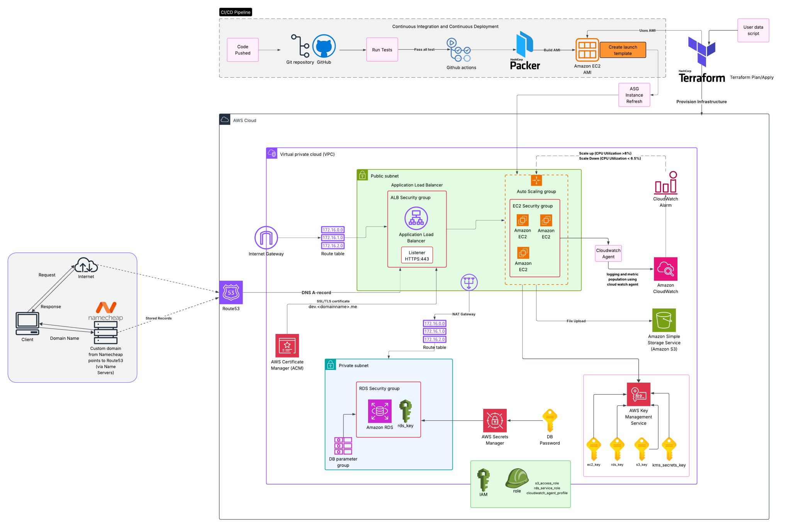

# Scalable Cloud Infrastructure on AWS ☁️

A scalable, secure, and highly available cloud infrastructure on **Amazon Web Services (AWS)** built with **Terraform**, **GitHub Actions**, and **HashiCorp Packer**. Developed as part of the *CSYE Network Structures and Cloud Computing* course at Northeastern University.

---

## 📌 Table of Contents

- [Overview](#overview)
- [Architecture](#architecture)
- [Tech Stack](#tech-stack)
- [Key Components](#key-components)
- [CI/CD Pipeline](#cicd-pipeline)
- [Security](#security)
- [Monitoring & Logging](#monitoring--logging)
- [Repositories](#repositories)
- [Getting Started](#getting-started)
- [Prerequisites](#prerequisites)
- [Conclusion](#conclusion)

---

## Overview

This project provisions a production-grade cloud infrastructure on AWS using infrastructure-as-code principles. The setup supports a Node.js web application with automated deployments, auto-scaling, encrypted storage, and centralized monitoring — all defined and managed through Terraform.

---

## Architecture



The architecture consists of:

- A **CI/CD pipeline** that builds and deploys AMIs via GitHub Actions and Packer
- A **VPC** with public and private subnets across availability zones
- An **Application Load Balancer** in the public subnet routing HTTPS traffic to EC2 instances
- An **Auto Scaling Group** managing EC2 instance lifecycle based on CPU metrics
- **Amazon RDS** in a private subnet for managed relational database storage
- **Amazon S3** for file storage with KMS encryption
- **AWS Secrets Manager** and **AWS KMS** for secrets and key management
- **Amazon Route 53** + **AWS ACM** for DNS and SSL/TLS termination
- **Amazon CloudWatch** for metrics, alarms, and centralized logging
- **AWS IAM** roles and instance profiles enforcing least-privilege access

---

## Tech Stack

| Category | Technology |
|---|---|
| Cloud Provider | Amazon Web Services (AWS) |
| Infrastructure as Code | HashiCorp Terraform |
| CI/CD | GitHub Actions |
| Image Build | HashiCorp Packer |
| Application Runtime | Node.js |
| Database | Amazon RDS |
| Object Storage | Amazon S3 |
| DNS | Amazon Route 53 |
| Monitoring | Amazon CloudWatch |
| Secrets Management | AWS Secrets Manager + AWS KMS |

---

## Key Components

### 🖥️ Compute — EC2 + Auto Scaling Group (ASG)
EC2 instances are deployed within an Auto Scaling Group and managed via launch templates built from custom AMIs. Auto-scaling is triggered by CloudWatch alarms:
- **Scale Up:** CPU Utilization > 8%
- **Scale Down:** CPU Utilization < 6.5%

### 🗄️ Database — Amazon RDS
Amazon RDS runs in a **private subnet**, isolated from direct internet access. It is secured with a dedicated RDS security group, encrypted with a KMS-managed `rds_key`, and its credentials are stored and rotated in **AWS Secrets Manager**.

### 🪣 Object Storage — Amazon S3
S3 handles file uploads from EC2 instances. All objects are encrypted at rest using a dedicated KMS `s3_key`.

### ⚖️ Load Balancing — Application Load Balancer (ALB)
The ALB distributes incoming HTTPS traffic (port 443) across EC2 instances. SSL/TLS termination is handled via an **AWS Certificate Manager (ACM)** certificate for `dev.<domainname>.me`.

### 🌐 DNS — Amazon Route 53
Route 53 manages DNS A-records pointing to the ALB. The custom domain registered via Namecheap is delegated to Route 53 through name server configuration.

### 🔐 IAM
EC2 instances are assigned instance profiles with scoped IAM roles following least-privilege:
- `s3_access_role` — read/write access to S3
- `rds_service_role` — access to RDS resources
- `cloudwatch_agent_profile` — permission to push logs and metrics to CloudWatch

---

## CI/CD Pipeline

```
Code Push → GitHub → Run Tests → Pass → Packer Builds AMI → Create Launch Template → ASG Instance Refresh
                                                                         ↑
                                                              Terraform Plan/Apply (provisions infra)
```

1. **Code is pushed** to the GitHub repository
2. **GitHub Actions** runs automated tests
3. On success, **HashiCorp Packer** builds a new Amazon Machine Image (AMI) with pre-installed dependencies
4. The new AMI is referenced in a **Launch Template**
5. **Terraform** provisions or updates infrastructure
6. An **ASG Instance Refresh** rolls out the new AMI to running instances with zero downtime

---

## Security

| Control | Implementation |
|---|---|
| Network Isolation | VPC with public/private subnet separation |
| Traffic Filtering | Security groups for ALB, EC2, and RDS (least-privilege) |
| Private Egress | NAT Gateway for private subnet outbound traffic |
| Encryption at Rest | AWS KMS keys: `ec2_key`, `rds_key`, `s3_key`, `kms_secrets_key` |
| Encryption in Transit | HTTPS via ACM SSL/TLS certificate |
| Secrets Management | AWS Secrets Manager for DB passwords and credentials |
| Access Control | IAM roles and instance profiles with scoped permissions |

---

## Monitoring & Logging

- **CloudWatch Agent** installed on EC2 instances ships application logs and system metrics
- **CloudWatch Alarms** trigger auto-scaling actions based on CPU thresholds
- **CloudWatch Dashboards** provide visibility into performance and health
- Centralized logging enables proactive incident detection and response

---

## Repositories

| Repository | Description | Access |
|---|---|---|
| [webapp](https://github.com/CSYE-NSCC-NIKESH-ORG/webapp) | Node.js web application source code and deployment instructions | Public |
| [tf-gcp-infra](https://github.com/CSYE-NSCC-NIKESH-ORG/tf-gcp-infra) | Terraform templates for AWS networking, VPC, subnets, and infrastructure | Private |
| [serverless](https://github.com/CSYE-NSCC-NIKESH-ORG/serverless) | Serverless functions and event-driven service configurations | Private |

---

## Getting Started

### Prerequisites

Ensure the following tools are installed and configured before deploying:

- [Terraform](https://developer.hashicorp.com/terraform/install) `>= 1.x`
- [AWS CLI](https://docs.aws.amazon.com/cli/latest/userguide/install-cliv2.html) configured with appropriate credentials
- [HashiCorp Packer](https://developer.hashicorp.com/packer/install) `>= 1.x`
- [Node.js](https://nodejs.org/) `>= 18.x`
- [Git](https://git-scm.com/)

### Deployment Steps

```bash
# 1. Clone the infrastructure repository
git clone https://github.com/CSYE-NSCC-NIKESH-ORG/tf-gcp-infra
cd tf-gcp-infra

# 2. Initialize Terraform
terraform init

# 3. Review the execution plan
terraform plan

# 4. Apply the infrastructure
terraform apply

# 5. Build the application AMI with Packer
cd ../webapp
packer build packer-config.pkr.hcl
```

> **Note:** GitHub Actions automates steps 5 onward on every push to the main branch.

---

## Conclusion

This project demonstrates building a production-ready, secure, and scalable cloud infrastructure on AWS using modern DevOps practices — infrastructure-as-code, automated CI/CD pipelines, encryption-by-default, and auto-scaling compute. The architecture is designed for high availability, operational efficiency, and security compliance.

---

*Built as part of the CSYE Network Structures and Cloud Computing course — Northeastern University*
